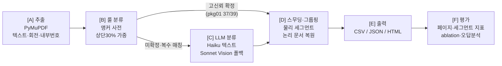

# 대출 서류 PDF 페이지 분류 및 문서 그룹핑 시스템

무작위로 섞인 모기지 대출 서류 패키지 PDF를 입력받아, 각 페이지를
`URLA_1003 | INCOME_DOC | CREDIT_REPORT | TITLE_REPORT | OTHER`로 분류하고,
페이지들을 문서 단위로 그룹핑(물리 세그먼트 + 논리 문서 복원)하는 파이프라인입니다.

**아키텍처: 룰 기반 1차 + LLM 2차 하이브리드 캐스케이드.** 값싸고 결정적인 신호(앵커
룰)로 고신뢰 페이지를 처리하고, 비싸고 유연한 모델(LLM)은 룰이 확정하지 못한
저신뢰 페이지에만 투입합니다. 대량 처리 시 비용·지연을 통제하면서 페이지별 판단
근거(evidence)를 남겨 설명 가능성을 확보하기 위한 선택입니다. 실측 기준 package_01은
39페이지 중 37페이지(94.9%)가 룰 단계에서 확정되어 LLM 호출은 전체의 ~5%로
억제되며, **전체 파이프라인의 package_01 자체 측정 정확도는 1.0000(39/39)** 입니다.

> **상용 API 사용 명시**: LLM 단계에 Anthropic Claude API를 사용했습니다 —
> 텍스트 분류 `claude-haiku-4-5-20251001`, Vision 폴백 `claude-sonnet-4-6`.
> API 키 없이도 `--no-llm` 플래그로 룰 기반 전체 흐름을 재현할 수 있습니다.

---

## 1. 실행 방법

### 설치

```bash
python3 -m venv .venv && source .venv/bin/activate   # Python 3.11+
pip install -r requirements.txt
```

### 데이터 배치

데이터는 과제 규정상 저장소에 포함하지 않습니다(`.gitignore`에 `data/**/*.pdf`).
아래 경로에 배치하세요.

```
data/testing/01.990145627_shuffled.pdf      # 과제 안내의 "PII Removed Ver_990145627" (개발/검증용, 39p)
data/validation/02.990367284_shuffled.pdf   # 과제 안내의 "package_02" (최종 추론 대상, 44p)
data/testing_answers/*.pdf                  # package_01 정답지: 원본 문서 4종 PDF (GT 생성용)
```

### 환경변수

```bash
cp .env.example .env
export ANTHROPIC_API_KEY=sk-ant-...   # LLM 단계에 필요. 미설정 시 --no-llm으로 실행
```

### 명령어

```bash
# 0) Ground truth 생성 (testing_answers/ 원본 PDF와 텍스트 매칭)
python -m src.main build-gt

# 1) package_01 분류 + 평가 (전체 파이프라인)
python -m src.main classify --input data/testing/01.990145627_shuffled.pdf \
    --output output/pkg01 --gt data/ground_truth_01.csv

# 2) package_02 분류 (최종 제출 결과)
python -m src.main classify --input data/validation/02.990367284_shuffled.pdf \
    --output output/pkg02

# 재현 모드: API 키 없이 룰 기반만으로 end-to-end 실행 (ablation 베이스라인)
python -m src.main classify --input ... --output output/pkg01_rules_only --no-llm --gt ...

# 문서별 PDF 재생성: 기존 documents.json 기반, LLM 재호출 없음
python -m src.main split --input data/testing/01.990145627_shuffled.pdf --output output/pkg01

# 단위 테스트 (룰 매칭 / 그룹핑 / GT·평가기 / LLM 케스케이드 mock — 21건)
python -m pytest tests/
```

출력물(`output/<pkg>/`): `page_classification.csv`, `documents.json`,
`report.html`(타임라인 스트립·분포 차트), `evaluation.md`, `error_analysis.md`(GT 있을 때),
`documents/<LABEL>_<n>.pdf`(논리 문서별로 셔플 해제 순서 + 정방향 회전 보정으로
재조립한 PDF — 셔플 패키지의 /Rotate 메타데이터를 제거해 원본 방향을 복원.
classify 시 자동 생성되며, **과제 데이터 재조립물이므로 저장소에는 커밋하지 않음**).
실측 검증: pkg01의 URLA(11p)·TITLE(9p) 분리 PDF는 원본 문서와 페이지 순서까지 완전
일치, CREDIT(18p)은 페이지 구성 완전 일치(무번호 부속 페이지의 순서만 휴리스틱 — §9-4).

---

## 2. 문제 정의

### 페이지 분류 = 시퀀스 라벨링

이 문제를 독립적인 페이지 단위 분류가 아니라 **시퀀스 라벨링**으로 프레이밍했습니다.
개별 페이지의 텍스트만으로는 판별이 안 되는 페이지(도면, 이미지 기반 P&L, 표지)가
존재하고, 이런 페이지의 라벨은 주변 페이지의 문맥에 의존하기 때문입니다. 그래서
LLM 프롬프트에 직전·직후 페이지의 1차 분류 결과와 첫 200자를 함께 제공하고,
후처리 스무딩도 시퀀스 관점에서 수행합니다. 평가 역시 페이지 레벨 지표에 더해
세그먼트 레벨 지표(boundary F1, document exact match)를 봅니다 — NER에서
token-level 평가와 entity-level 평가를 나누는 것과 동형의 구조입니다.

### 셔플 패키지에서 "문서"의 이중 정의

페이지가 무작위로 섞인 순간 "문서"는 두 가지 의미로 갈라지며, 실무 용도가 다르므로
**둘 다 산출**합니다.

| 정의 | 산출물 | 실무 용도 |
|---|---|---|
| **물리 세그먼트**: 입력 PDF에서 인접한 동일 라벨 페이지 묶음 | `physical_segments` | 뷰어에서 페이지 범위 하이라이트, 스플릿 지점 표시 등 입력 파일 기준 작업 |
| **논리 문서**: 내부 페이지 번호("N of M")+라벨로 복원한 원본 문서 | `logical_documents` | 원본 문서 재조립(언셔플), 문서 단위 다운스트림 처리(AUS 제출, 데이터 추출) |

셔플 패키지에서는 물리 세그먼트가 대부분 길이 1이 되므로(라벨이 계속 바뀜),
논리 문서 복원이 실질적인 "문서 단위 그룹핑"입니다. package_01의 논리 복원 결과는
원본 문서(testing_answers)의 페이지 순서와 완전히 일치함을 확인했습니다.

---

## 3. 접근 방식과 처리 흐름



- **[A] 추출** (`extractor.py`): PyMuPDF로 페이지별 텍스트·회전각·이미지 수·내부
  페이지 번호("Page N of M", "N of M", "Page N" — 대소문자 무시)를 추출.
  `get_text()`는 /Rotate를 자동 보정하므로 텍스트 경로에선 회전을 무시할 수 있고,
  블록 bbox가 회전 반영 시각 좌표계로 반환됨을 실측 확인해 상단 30% 영역(head)을
  좌표 그대로 필터링합니다. 텍스트 200자 미만, 또는 이미지가 있으면서 500자
  미만인 페이지는 Vision 폴백 후보로 표시합니다(후자는 이미지 위 얇은 텍스트
  레이어 오판 사례에서 도출한 조건 — §7).
- **[B] 룰 분류** (`rule_classifier.py`): 배타적 시그니처(문서 헤더·폼 번호) 앵커
  사전. head 매칭 100%, 본문 매칭 60% 가중(URLA 시그니처는 푸터에 있어 본문 검색
  유지). 1위 점수가 임계값(5.0) 이상이고 2위와 격차(3.0) 이상일 때만 확정하며,
  미달·복수 유형 근접 시 LLM에 위임합니다. **OTHER는 매칭 실패의 기본값이 아니라
  LLM 판정을 거친 뒤에만 부여**됩니다(--no-llm 모드에서는 `rule_unresolved`로 표기).
- **[C] LLM 분류** (`llm_classifier.py`): 위임된 페이지만. 텍스트 페이지는
  `claude-haiku-4-5-20251001`, 텍스트 부족/실패 시 `claude-sonnet-4-6` Vision 폴백
  (150dpi PNG). 프롬프트에 5개 유형 정의, 대상 텍스트(2,000자 절삭), 직전·직후
  페이지의 1차 분류와 첫 200자(경계 정확도용 시퀀스 문맥)를 포함. 응답은 Pydantic으로
  검증하고 실패 시 1회 재시도 후 OTHER/0.0. `LLMProvider` 인터페이스로 OpenAI 등
  교체 가능. 호출 수·토큰·시간을 페이지별 로깅.
- **[D] 스무딩·그룹핑** (`grouper.py`): §2의 이중 산출. 스무딩은 보수적으로 —
  동일 라벨 사이에 낀 단일 이질 페이지를 confidence<0.6이고 내부 번호 체계(M)가
  이웃과 일치할 때만 다수결 보정하고 이력을 로그로 남깁니다(셔플 패키지에선 진짜
  단독 페이지일 수 있으므로).
- **[E] 출력** (`reporter.py`), **[F] 평가** (`evaluator.py`): §1의 출력물 참조.

---

## 4. 기술 스택 선택 근거와 선택하지 않은 것들

**선택**: Python 3.11, PyMuPDF, Anthropic SDK, Pydantic, pandas, matplotlib, pytest
— 의존성 최소화.

**선택하지 않은 것들과 이유:**

- **(a) Tesseract OCR 대신 Vision LLM 폴백**: 이 데이터는 born-digital이라 텍스트
  레이어가 대부분 살아 있고, 문제가 되는 것은 텍스트가 거의 없는 이미지 기반
  페이지(도면, 스캔 P&L) 소수뿐입니다. OCR은 회전·저품질 이미지에서 전처리
  파이프라인(deskew·rotate 판정)이 추가로 필요하고 레이아웃 신호(표·양식 구조)를
  잃지만, Vision LLM은 렌더링 이미지 한 장으로 레이아웃·시각 단서까지 활용하며
  회전 페이지에도 강건합니다. 페이지 수가 적어(패키지당 1~5장) 비용도 무시 가능
  — 구현 비용 대비 효용에서 Vision 폴백이 우세합니다.
- **(b) 순수 LLM 전체 분류 대신 하이브리드**: 전 페이지 LLM 호출은 39페이지 기준
  ~39회 호출로, 룰 캐스케이드(pkg01 기준 2회)보다 비용·지연이 ~20배입니다.
  또한 룰 확정 페이지는 "어떤 앵커가 몇 점으로 매칭됐는지"가 그대로 감사 가능한
  판단 근거가 되어 설명 가능성이 높습니다. 대량 처리(수천 패키지) 시나리오에서
  이 차이는 운영 비용 구조를 결정합니다.
- **(c) 학습 기반 분류기(LayoutLM 등) 미사용**: 라벨 데이터가 1개 패키지
  39페이지뿐이라 학습·검증 분할 자체가 불가능합니다. fine-tuning 없는 사전학습
  모델 추론도 GPU 의존성·서빙 비용이 추가되는데, 이 문제는 앵커+LLM으로 이미
  충분한 정확도가 나옵니다. 문서 유형이 수십 개로 늘고 라벨 데이터가 축적되면
  재검토할 대상입니다(§9).
- **(d) LangChain 미사용**: 호출 지점이 2곳(텍스트/Vision)뿐인 이 규모에서는
  순수 SDK가 더 단순하고, 프롬프트·재시도·로깅을 직접 제어하는 편이 디버깅
  가능성이 높습니다. 추상화 계층은 `LLMProvider` 인터페이스 하나로 충분합니다.

---

## 5. 가정 (Assumptions)

1. **정답지**: 과제 안내상 "정답 미제공"이지만, `data/testing_answers/`에 package_01의
   **원본 구성 문서 4종 PDF**가 제공되어 있어, 셔플 페이지와 원본 페이지를 정규화
   텍스트 완전 일치로 매칭해 정답지를 결정적으로 복원했습니다
   (`src/gt_builder.py` → `data/ground_truth_01.csv`, **39/39 완전 일치, fuzzy 매칭 0건**).
   따라서 잠정 정답지가 아닌 원본 유래 정답지로 평가했습니다.
2. **애매 페이지 정책 (Xactus 소비자 안내문 4p, Credit Score Disclosure 등 2p)**:
   이 6페이지는 tri-merge 본체가 아닌 신용 벤더 산출물/렌더 고지서라 OTHER로 볼
   여지가 있으나, 원본 정답지의 `Credit Report_990145627.pdf`(18p)가 이들을 모두
   포함하고 있어 **CREDIT_REPORT로 확정**했습니다. 정답지가 없었다면 "신용 패키지
   부속물로 보아 CREDIT_REPORT" vs "본체 아님 → OTHER"의 정책 결정이 필요했을
   항목입니다. package_02에도 같은 정책을 적용했습니다.
3. **스무딩 보정 조건**: (i) 동일 라벨 시퀀스 한가운데 낀 단일 이질 페이지,
   (ii) confidence < 0.6, (iii) 내부 페이지 번호 체계(M)가 이웃과 일치 — 세 조건을
   모두 만족할 때만 다수결 보정하며, 보정 이력은 `documents.json`의
   `meta.smoothing_log`에 남깁니다. 실측에서는 두 패키지 모두 보정 발동 0건
   (셔플 패키지 특성상 인접 페이지 라벨이 대부분 다르므로 의도된 결과).
4. **논리 문서 인스턴스 분리**: 같은 (label, M)에서 내부 번호 N이 중복되면 문서
   2부로 판단해 인스턴스를 분리하고, 물리 순서를 보존해 배정합니다(pkg02의 Title
   Commitment 5p×2부, IRS 트랜스크립트 2p×2부에서 실제 발동). 어느 1페이지가 어느
   2페이지와 같은 부(copy)인지는 내부 번호만으로는 결정 불가능하므로 물리 순서
   보존을 타이브레이커로 사용합니다(한계 — §9).

---

## 6. package_01 자체 측정 정확도

**측정 방법**: `python -m src.main classify --input data/testing/01.990145627_shuffled.pdf
--output output/pkg01 --gt data/ground_truth_01.csv` (GT는 §5-1의 원본 유래 정답지).

### Ablation: 룰만 (--no-llm) vs 전체 파이프라인 (실측)

| 구성 | 페이지 accuracy | macro-F1 | boundary F1 | doc exact match | LLM 호출 |
|---|---|---|---|---|---|
| 룰만 (`--no-llm`) | 0.9487 (37/39) | 0.7353 | 0.949 | 0.9487 | 0 |
| 전체 (룰+LLM) | **1.0000** (39/39) | **1.0000** | 1.000 | 1.0000 | 2 (Vision 2) |

룰 단계의 미확정 2건(p08 도면, p36 이미지 P&L)은 정확히 LLM 위임 대상으로 표시된
페이지들로, 룰의 실질 오분류(고신뢰 확정 후 오답)는 **0건**입니다. 두 페이지 모두
Vision 폴백(`claude-sonnet-4-6`)이 정답 처리했습니다 — p08은 plat map 도면임을,
p36은 W-2/소득 요약 이미지임을 시각적으로 판별. 논리 문서 복원도 원본 4종
(CREDIT 18p / URLA 11p / TITLE 9p / INCOME 1p)과 완전히 일치합니다.

전체 파이프라인의 클래스별 지표는 5개 클래스 모두 P/R/F1 = 1.000
(OTHER는 support 0)이며, 자세한 표는 `output/pkg01/evaluation.md`에 있습니다.
아래는 LLM 기여를 보여주는 룰만(--no-llm) 베이스라인의 상세입니다.

### 룰만(--no-llm) 상세: 클래스별 지표

| label | precision | recall | f1 | support |
|---|---|---|---|---|
| URLA_1003 | 1.000 | 1.000 | 1.000 | 11 |
| INCOME_DOC | 0.000 | 0.000 | 0.000 | 1 |
| CREDIT_REPORT | 1.000 | 1.000 | 1.000 | 18 |
| TITLE_REPORT | 1.000 | 0.889 | 0.941 | 9 |
| OTHER | 0.000 | 0.000 | 0.000 | 0 |

macro-F1(0.735)이 accuracy 대비 낮은 것은 support 1짜리 INCOME_DOC 클래스가 통째로
빠졌기 때문 — 클래스 불균형(1 vs 18)에서 macro 평균이 소수 클래스에 지배되는 전형적
사례로, 이 간극 자체가 LLM 단계의 기여를 보여줍니다.

### Confusion matrix (행=GT, 열=pred, 룰만)

| GT\pred | URLA_1003 | INCOME_DOC | CREDIT_REPORT | TITLE_REPORT | OTHER |
|---|---|---|---|---|---|
| URLA_1003 | 11 | 0 | 0 | 0 | 0 |
| INCOME_DOC | 0 | 0 | 0 | 0 | 1 |
| CREDIT_REPORT | 0 | 0 | 18 | 0 | 0 |
| TITLE_REPORT | 0 | 0 | 0 | 8 | 1 |
| OTHER | 0 | 0 | 0 | 0 | 0 |

---

## 7. 오답 분석 요약

최종 파이프라인의 package_01 오답은 **0건**입니다
([output/pkg01/error_analysis.md](output/pkg01/error_analysis.md)). 개발 과정에서
발생했던 오답과 그 분석·해결 과정이 설계 결정에 반영되어 있습니다:

- **p08 (룰 단계 미확정 → Vision으로 해결)**: plat map 플레이스홀더, 84자. 권원보고서
  구성물이지만 텍스트 단서가 없어 룰·텍스트 LLM 모두 판별 불가. 텍스트 200자 미만
  조건으로 Vision 폴백 → TITLE_REPORT 정답.
- **p36 (텍스트 LLM 오답 → Vision 조건 확장으로 해결)**: 이미지 기반 소득 서류인데
  텍스트 레이어가 250자라 초기 Vision 임계값(200자)을 통과, 텍스트 LLM이 숫자
  나열만 보고 OTHER(0.85)로 오판했습니다. 오답 분석 결과 "이미지가 있는 페이지의
  얇은 텍스트 레이어" 패턴임을 확인하고 Vision 조건을 `텍스트 < 200자 OR (이미지
  존재 AND 텍스트 < 500자)`로 확장 → Vision이 W-2/소득 요약임을 판별해 정답.
  참고로 이 페이지에는 고용주명 "Veronica Salazar Realtor"가 노출되는데, "Realtor"
  같은 일반 단어를 INCOME 앵커로 쓰면 URLA 본문(같은 고용주명 등장)이 오분류되므로
  룰 보강이 아닌 Vision으로 푸는 것이 옳은 케이스입니다(§4의 함정).

두 건 모두 근본 원인이 "텍스트 신호 부재"로, 앵커를 느슨하게 만들면 정밀도가
무너지는 트레이드오프를 확인했고 Vision 폴백 경로가 올바른 해법임을 검증했습니다.

---

## 8. 비용·성능

실측치(전체 파이프라인, Apple Silicon 로컬):

| 항목 | package_01 (39p) | package_02 (44p) |
|---|---|---|
| 전체 처리 시간 | 9.2초 (룰만: 0.1초) | 29.8초 (룰만: 0.2초) |
| 룰 단계 확정 비율 | 37/39 (94.9%) | 37/44 (84.1%) |
| LLM 호출 | 2 (Vision 2) | 7 (텍스트 2 + Vision 5) |
| LLM 입력/출력 토큰 | 5,559 / 238 | 16,338 / 898 |
| LLM 소요 시간 | 8.5초 | 29.1초 |

비용 환산 시 Vision(Sonnet 4.6, $3/$15 per MTok) 기준 **패키지당 1센트 미만**입니다.
순수 LLM 전체 분류 대비 호출 수가 39→2 (pkg01), 44→7 (pkg02)로 줄어드는 것이
하이브리드의 핵심 효과이며, 페이지별 호출·토큰·지연 로그는 `documents.json`의
`meta.cost.per_page_log`에 기록됩니다.

---

## 9. 한계와 다음 단계

1. **문서 유형 추가**: 새 유형은 (i) 앵커 사전에 배타적 시그니처 5~10개 추가,
   (ii) LLM 프롬프트의 유형 정의에 1항목 추가 + 대표 페이지 few-shot 예시 확장으로
   대응 가능합니다. 앵커 후보는 신규 패키지 EDA(`src/eda.py`)의 head 텍스트에서
   반자동 추출할 수 있습니다. 유형이 수십 개로 늘면 앵커 충돌 관리 비용이 커지므로
   그 시점에 임베딩 기반 검색 또는 LayoutLM 계열 학습 분류기를 재검토합니다.
2. **대량 처리**: 현재는 순차 처리입니다. 수천 패키지 규모에서는 (i) 패키지 단위
   프로세스 병렬화(추출·룰은 CPU-bound, PDF당 독립), (ii) LLM 위임 페이지를 모아
   **Anthropic Batch API**(50% 할인, 24h SLA)로 일괄 처리, (iii) 시스템 프롬프트
   prompt caching(유형 정의부 고정)으로 입력 토큰 절감 — 순으로 도입합니다.
3. **데이터 추출 단계(AUS 연결) 설계 스케치**: 분류·그룹핑이 끝나면 논리 문서
   단위로 유형별 추출기를 붙입니다 — URLA는 폼 필드 구조가 표준(1003)이므로 섹션
   앵커 + LLM structured output(Pydantic 스키마: 차주 정보, 소득, 자산·부채)으로
   추출하고, 신용보고서에서 FICO 3사 점수·tradeline, 소득 서류에서 소득 수치를
   뽑아 AUS(DU/LP) 제출 페이로드로 매핑합니다. 추출값에는 근거 페이지·문구
   (evidence)를 함께 저장해 언더라이터 검증 루프를 지원합니다.
4. **논리 문서 복원의 한계**: 문서 2부가 섞인 경우 부(copy) 간 페이지 배정은 물리
   순서 보존 휴리스틱이라, 두 부의 내용이 다르면(예: 수정 전/후 버전) 오배정될 수
   있습니다. 또한 내부 번호가 없는 페이지(표지·안내문 등)는 "번호 페이지 뒤에 물리
   순서로 부착"하므로 원본의 정확한 위치(예: 신용보고서의 표지가 맨 앞)는 복원되지
   않습니다 — pkg01 실측에서 CREDIT 분리 PDF가 구성은 완전 일치하지만 부속 페이지
   순서가 원본과 다른 것이 이 한계입니다. 페이지 간 내용 유사도(차주명, Report ID 등
   키 필드 매칭)와 페이지 유형 사전 지식(표지는 선두)을 타이브레이커로 추가하는 것이
   다음 단계입니다.
5. **스무딩의 실효성**: 완전 셔플 패키지에서는 발동 조건이 거의 성립하지 않습니다
   (실측 0건). 부분 셔플·스캔 순서 뒤섞임 같은 실운영 입력에서 효과가 있는
   장치이며, 완전 셔플에서는 논리 문서 복원이 그 역할을 대신합니다.
