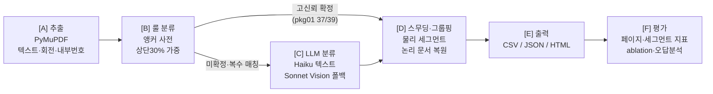

# 대출 서류 PDF 페이지 분류 및 문서 그룹핑

무작위로 섞인 모기지 대출 서류 패키지 PDF를 입력받아, 각 페이지를
`URLA_1003 | INCOME_DOC | CREDIT_REPORT | TITLE_REPORT | OTHER` 중 하나로 분류하고,
분류된 페이지들을 문서 단위로 묶는(물리 세그먼트 + 논리 문서 복원) 프로그램입니다.

전체 구조는 **룰 기반 1차 분류 + LLM 2차 분류의 하이브리드**로 잡았습니다.
문서 헤더나 폼 번호처럼 확실한 단서가 있는 페이지는 비용이 들지 않는 룰로 먼저
처리하고, 룰만으로 판단하기 어려운 페이지만 LLM에 넘기는 방식입니다. 이렇게 하면
LLM 호출 비용과 처리 시간을 줄일 수 있고, 룰로 확정된 페이지는 "어떤 문구가
매칭되었는지"를 근거로 남길 수 있어서 결과를 검증하기도 쉽다고 판단했습니다.
직접 측정해 본 결과 package_01은 39페이지 중 37페이지(94.9%)가 룰 단계에서
확정되었고, **전체 파이프라인의 package_01 자체 측정 정확도는 1.0000(39/39)**
이었습니다.

> **상용 API 사용 안내**: LLM 단계에 Anthropic Claude API를 사용했습니다 —
> 텍스트 분류에 `claude-haiku-4-5-20251001`, Vision 폴백에 `claude-sonnet-4-6`.
> API 키가 없어도 `--no-llm` 옵션으로 룰 기반 흐름 전체를 실행해 볼 수 있습니다.

---

## 1. 실행 방법

### 설치

```bash
python3 -m venv .venv && source .venv/bin/activate   # Python 3.11+
pip install -r requirements.txt
```

### 데이터 배치

과제 데이터는 외부 공유가 금지되어 있어 저장소에 포함하지 않았습니다
(`.gitignore`에 `data/**/*.pdf`). 아래 경로에 파일을 넣고 실행해 주세요.

```
data/testing/01.990145627_shuffled.pdf      # 과제 안내의 "PII Removed Ver_990145627" (개발/검증용, 39p)
data/validation/02.990367284_shuffled.pdf   # 과제 안내의 "package_02" (최종 추론 대상, 44p)
data/testing_answers/*.pdf                  # package_01 정답지: 원본 문서 4종 PDF (GT 생성용)
```

### 환경변수

```bash
cp .env.example .env
export ANTHROPIC_API_KEY=sk-ant-...   # LLM 단계에 필요. 없으면 --no-llm으로 실행
```

### 명령어

```bash
# 0) Ground truth 생성 (testing_answers/ 원본 PDF와 텍스트 매칭)
python -m src.main build-gt

# 1) package_01 분류 + 평가 (전체 파이프라인)
python -m src.main classify --input data/testing/01.990145627_shuffled.pdf \
    --output output/pkg01 --gt data/ground_truth_01.csv

# 2) package_02 분류 (최종 제출 결과)
python -m src.main classify --input data/validation/02.990367284_shuffled.pdf \
    --output output/pkg02

# 재현 모드: API 키 없이 룰 기반만으로 실행 (ablation 비교용)
python -m src.main classify --input ... --output output/pkg01_rules_only --no-llm --gt ...

# 문서별 PDF 재생성: 기존 documents.json 기반, LLM 재호출 없음
python -m src.main split --input data/testing/01.990145627_shuffled.pdf --output output/pkg01

# 단위 테스트 (룰 매칭 / 그룹핑 / GT·평가기 / LLM 케스케이드 mock — 21건)
python -m pytest tests/
```

출력물(`output/<pkg>/`):
- `page_classification.csv` — 페이지별 라벨·confidence·판단 방법·근거 문구
- `documents.json` — 물리 세그먼트 + 논리 문서 복원 결과 + 실행 메타(비용 로그 포함)
- `report.html` — 페이지 타임라인 색 스트립, 라벨 분포, confidence 분포, 결과 표
- `evaluation.md`, `error_analysis.md` — GT를 지정했을 때의 평가·오답 분석
- `documents/<LABEL>_<n>.pdf` — 논리 문서별로 셔플을 해제한 순서 + 정방향 회전
  보정으로 재조립한 PDF. 셔플 패키지에 씌워진 /Rotate 메타데이터를 제거해 원본
  방향을 복원합니다. classify 실행 시 자동 생성되며, **과제 데이터를 재조립한
  것이므로 저장소에는 올리지 않았습니다.**
  검증해 본 결과 pkg01의 URLA(11p)·TITLE(9p) 분리 PDF는 원본 문서와 페이지
  순서까지 일치했고, CREDIT(18p)은 페이지 구성은 모두 일치하지만 내부 번호가 없는
  부속 페이지의 순서에는 한계가 있었습니다(§9-4).

---

## 2. 문제 정의

### 페이지 분류를 어떻게 바라봤는지

처음에는 페이지 하나하나를 독립적으로 분류하는 문제로 생각했는데, 데이터를
살펴보니 페이지 단독으로는 판별이 안 되는 경우(도면, 이미지 기반 소득 서류,
표지 등)가 있었습니다. 이런 페이지는 주변 페이지의 정보가 판단에 도움이 되기
때문에, 개별 분류보다는 **시퀀스 라벨링에 가까운 문제**로 접근했습니다.
그래서 LLM 프롬프트에 직전·직후 페이지의 1차 분류 결과와 첫 200자를 함께
넣었고, 후처리 스무딩도 앞뒤 페이지를 보는 방식으로 만들었습니다. 평가도
페이지 단위 지표와 함께 세그먼트 단위 지표(boundary F1, document exact match)를
같이 봤는데, NER에서 토큰 단위 평가와 개체 단위 평가를 나누어 보는 것과 비슷한
구조라고 이해했습니다.

### 셔플된 패키지에서 "문서"란 무엇인지

페이지가 무작위로 섞이면 "문서 단위 그룹핑"이 두 가지 의미로 나뉜다는 것을
알게 되었고, 용도가 서로 달라서 둘 다 산출하기로 했습니다.

| 정의 | 산출물 | 쓰임새 |
|---|---|---|
| **물리 세그먼트**: 입력 PDF에서 인접한 동일 라벨 페이지 묶음 | `physical_segments` | 입력 파일 기준 작업 (뷰어에서 페이지 범위 표시, 분할 지점 표시 등) |
| **논리 문서**: 내부 페이지 번호("N of M")+라벨로 복원한 원본 문서 | `logical_documents` | 원본 문서 재조립, 문서 단위 후속 처리 (AUS 제출, 데이터 추출) |

셔플된 패키지에서는 라벨이 계속 바뀌어 물리 세그먼트가 대부분 길이 1이 되므로,
실질적인 문서 그룹핑은 논리 문서 복원 쪽이었습니다. package_01의 복원 결과를
원본 문서(testing_answers)와 비교해 페이지 순서까지 일치하는 것을 확인했습니다.

---

## 3. 접근 방식과 처리 흐름



- **[A] 추출** (`extractor.py`): PyMuPDF로 페이지별 텍스트, 회전각, 이미지 수,
  내부 페이지 번호("Page N of M", "N of M", "Page N" — 대소문자 무시)를 뽑습니다.
  `get_text()`가 /Rotate를 자동 보정해 주어 텍스트 처리에서는 회전을 신경 쓰지
  않아도 된다는 것을 확인했고, 블록 좌표가 회전이 반영된 화면 기준으로 나오는
  것도 실제로 돌려 보고 확인한 뒤 상단 30% 영역(head) 필터에 그대로 사용했습니다.
  텍스트가 200자 미만이거나, 이미지가 있으면서 500자 미만인 페이지는 Vision 폴백
  후보로 표시합니다(뒤쪽 조건은 오답 분석 과정에서 추가한 것입니다 — §7).
- **[B] 룰 분류** (`rule_classifier.py`): 문서 헤더·폼 번호처럼 해당 문서에서만
  나오는 문구를 앵커 사전으로 만들어 점수를 매깁니다. 상단 매칭은 100%, 본문
  매칭은 60% 가중치를 줬는데, URLA는 식별 문구가 페이지 하단(푸터)에 있어서 본문
  검색도 남겨 두었습니다. 1위 점수가 임계값(5.0) 이상이고 2위와의 차이가 3.0
  이상일 때만 확정하고, 그 외에는 LLM에 넘깁니다. **OTHER는 매칭 실패의 기본값이
  아니라 LLM 판정을 거친 뒤에만 부여**하도록 했습니다(--no-llm 모드에서는
  `rule_unresolved`로 표기됩니다).
- **[C] LLM 분류** (`llm_classifier.py`): 룰이 넘긴 페이지만 처리합니다. 텍스트가
  있는 페이지는 `claude-haiku-4-5-20251001`로, 텍스트가 부족하거나 텍스트 분류가
  실패하면 `claude-sonnet-4-6`에 150dpi로 렌더링한 페이지 이미지를 보냅니다.
  프롬프트에는 5개 유형의 정의, 대상 페이지 텍스트(2,000자까지), 직전·직후
  페이지의 1차 분류 결과와 첫 200자를 넣었습니다. 응답은 Pydantic으로 검증하고,
  파싱에 실패하면 1회 재시도 후 OTHER/confidence 0.0으로 처리합니다.
  `LLMProvider` 인터페이스를 두어 다른 provider(OpenAI 등)로 교체할 수 있게
  했고, 호출 수·토큰·소요 시간을 페이지별로 기록합니다.
- **[D] 스무딩·그룹핑** (`grouper.py`): §2에서 설명한 두 가지 그룹핑을 만듭니다.
  스무딩은 조심스럽게 적용했습니다 — 같은 라벨 사이에 낀 단일 페이지가
  confidence 0.6 미만이고 내부 번호 체계(M)가 이웃과 일치할 때만 다수결로
  보정하고, 보정 내역을 로그로 남깁니다. 셔플된 패키지에서는 진짜로 한 장짜리
  페이지일 수 있기 때문입니다.
- **[E] 출력** (`reporter.py`, `splitter.py`), **[F] 평가** (`evaluator.py`):
  §1의 출력물 목록을 참고해 주세요.

---

## 4. 기술 선택과, 선택하지 않은 것들

**사용한 것**: Python 3.11, PyMuPDF, Anthropic SDK, Pydantic, matplotlib, pytest.
의존성은 필요한 것만 넣으려고 노력했습니다.

**검토했지만 사용하지 않은 것들과 그 이유:**

- **(a) Tesseract OCR 대신 Vision LLM 폴백**: 데이터를 확인해 보니 대부분의
  페이지에 텍스트 레이어가 살아 있었고(born-digital), 문제가 되는 것은 텍스트가
  거의 없는 이미지 기반 페이지 몇 장뿐이었습니다. OCR을 쓰면 회전·품질 문제에
  대한 전처리가 추가로 필요하고 표나 양식 같은 레이아웃 정보도 잃게 되는데,
  Vision LLM은 렌더링한 이미지 한 장으로 시각적인 단서까지 활용할 수 있고 회전된
  페이지에도 강했습니다. 대상 페이지가 패키지당 1~5장 수준이라 비용 부담도 크지
  않아서, 구현 비용 대비 Vision 폴백이 낫다고 판단했습니다.
- **(b) 전 페이지 LLM 분류 대신 하이브리드**: 모든 페이지를 LLM에 보내면
  39페이지 기준 약 39회 호출이 필요한데, 룰을 먼저 태우면 2회로 줄어듭니다
  (pkg01 기준). 비용과 지연이 크게 차이 나고, 룰로 확정한 페이지는 매칭된 문구가
  그대로 판단 근거가 되어 결과를 검증하기도 쉽습니다. 패키지가 수천 건으로
  늘어나는 상황을 생각하면 이 차이가 더 커진다고 생각했습니다.
- **(c) 학습 기반 분류기(LayoutLM 등)**: 라벨이 있는 데이터가 1개 패키지
  39페이지뿐이라 학습은 물론 검증 데이터 분리도 어려웠습니다. 사전학습 모델을
  그대로 쓰는 방법도 있지만 GPU 의존성과 서빙 비용이 추가되는데, 이 문제는
  앵커+LLM 조합으로도 충분한 정확도가 나왔습니다. 문서 유형이 많아지고 라벨
  데이터가 쌓이면 다시 검토해 볼 만한 선택지라고 생각합니다(§9).
- **(d) LangChain**: LLM 호출 지점이 텍스트/Vision 두 곳뿐이라, 이 규모에서는
  공식 SDK를 직접 쓰는 편이 코드가 단순하고 프롬프트·재시도·로깅을 직접 다루기도
  쉬웠습니다. 추상화는 `LLMProvider` 인터페이스 하나로 충분했습니다.

---

## 5. 가정한 것들 (Assumptions)

1. **정답지**: 과제 안내에는 "정답지 포함"으로 되어 있는데, 실제로는
   `data/testing_answers/`에 package_01의 **원본 구성 문서 4종 PDF**가 제공되어
   있었습니다. 그래서 셔플된 페이지와 원본 페이지를 정규화한 텍스트로 매칭해
   페이지 레벨 정답지를 만들었습니다(`src/gt_builder.py` →
   `data/ground_truth_01.csv`, **39/39 완전 일치, 유사도 매칭 0건**). 평가는 이
   정답지를 기준으로 했습니다.
2. **판단이 애매했던 페이지들 (Xactus 소비자 안내문 4장, Credit Score Disclosure 등 2장)**:
   이 6장은 신용조회 본체(tri-merge)가 아니라 벤더 안내문·대출사 고지서라서
   OTHER로 볼 여지도 있었습니다. 다만 정답지인 `Credit Report_990145627.pdf`(18p)가
   이 페이지들을 모두 포함하고 있어서 **CREDIT_REPORT로 확정**했고, package_02에도
   같은 기준을 적용했습니다. 정답지가 없었다면 별도의 정책 결정이 필요했을
   부분이라 기록해 둡니다.
3. **스무딩 보정 조건**: (i) 같은 라벨 사이에 낀 단일 페이지, (ii) confidence <
   0.6, (iii) 내부 번호 체계(M)가 이웃과 일치 — 세 가지를 모두 만족할 때만
   보정하고, 내역은 `documents.json`의 `meta.smoothing_log`에 남습니다. 실제로는
   두 패키지 모두 보정이 발동하지 않았는데, 완전히 섞인 패키지에서는 인접 페이지
   라벨이 대부분 달라서 조건이 성립하기 어렵기 때문입니다.
4. **같은 문서가 여러 부 있을 때**: 같은 (label, M)에서 내부 번호 N이 중복되면
   문서가 2부 있다고 보고 인스턴스를 분리했고, 페이지 배정은 물리 순서를
   유지했습니다(pkg02의 Title Commitment 5p×2부, IRS 트랜스크립트 2p×2부에서 실제
   발동). 어느 페이지가 어느 부에 속하는지는 내부 번호만으로 알 수 없어서 물리
   순서를 기준으로 삼았는데, 한계가 있는 방식입니다(§9-4).

---

## 6. package_01 자체 측정 정확도

**측정 방법**: `python -m src.main classify --input data/testing/01.990145627_shuffled.pdf
--output output/pkg01 --gt data/ground_truth_01.csv` (GT는 §5-1에서 만든 정답지).

### Ablation: 룰만 (--no-llm) vs 전체 파이프라인

| 구성 | 페이지 accuracy | macro-F1 | boundary F1 | doc exact match | LLM 호출 |
|---|---|---|---|---|---|
| 룰만 (`--no-llm`) | 0.9487 (37/39) | 0.7353 | 0.949 | 0.9487 | 0 |
| 전체 (룰+LLM) | **1.0000** (39/39) | **1.0000** | 1.000 | 1.0000 | 2 (Vision 2) |

룰 단계에서 확정하지 못한 2건(p08 도면, p36 이미지 P&L)은 모두 LLM 위임 대상으로
표시된 페이지였고, 룰이 높은 confidence로 확정해 놓고 틀린 경우는 없었습니다.
두 페이지 모두 Vision 폴백(`claude-sonnet-4-6`)이 정답을 맞혔습니다 — p08은 plat
map 도면임을, p36은 W-2/소득 요약 이미지임을 이미지에서 판별했습니다. 논리 문서
복원 결과도 원본 4종(CREDIT 18p / URLA 11p / TITLE 9p / INCOME 1p)과 일치했습니다.

전체 파이프라인 기준 클래스별 지표는 5개 클래스 모두 P/R/F1 = 1.000이며(OTHER는
support 0), 상세 표는 `output/pkg01/evaluation.md`에 있습니다. 아래는 LLM 단계가
기여한 부분을 보여주는 룰만(--no-llm) 기준의 상세입니다.

### 룰만(--no-llm) 상세: 클래스별 지표

| label | precision | recall | f1 | support |
|---|---|---|---|---|
| URLA_1003 | 1.000 | 1.000 | 1.000 | 11 |
| INCOME_DOC | 0.000 | 0.000 | 0.000 | 1 |
| CREDIT_REPORT | 1.000 | 1.000 | 1.000 | 18 |
| TITLE_REPORT | 1.000 | 0.889 | 0.941 | 9 |
| OTHER | 0.000 | 0.000 | 0.000 | 0 |

macro-F1(0.735)이 accuracy에 비해 낮은 이유는 support가 1인 INCOME_DOC 클래스를
통째로 놓쳤기 때문입니다. 클래스 불균형(1 vs 18) 상황에서 macro 평균이 소수
클래스에 크게 좌우된다는 것을 확인할 수 있었고, 이 간극이 LLM 단계가 채워 주는
부분이었습니다.

### Confusion matrix (행=GT, 열=pred, 룰만)

| GT\pred | URLA_1003 | INCOME_DOC | CREDIT_REPORT | TITLE_REPORT | OTHER |
|---|---|---|---|---|---|
| URLA_1003 | 11 | 0 | 0 | 0 | 0 |
| INCOME_DOC | 0 | 0 | 0 | 0 | 1 |
| CREDIT_REPORT | 0 | 0 | 18 | 0 | 0 |
| TITLE_REPORT | 0 | 0 | 0 | 8 | 1 |
| OTHER | 0 | 0 | 0 | 0 | 0 |

---

## 7. 오답 분석

최종 파이프라인 기준 package_01 오답은 **0건**입니다
([output/pkg01/error_analysis.md](output/pkg01/error_analysis.md)). 다만 개발
과정에서 오답이 있었고, 그 분석 결과가 설계에 반영되어 있어서 과정을 남깁니다.

- **p08 (룰 단계 미확정 → Vision으로 해결)**: plat map 자리표시 페이지, 84자.
  권원보고서의 구성물이지만 텍스트 단서가 없어 룰로도 텍스트 LLM으로도 판별이
  어려웠습니다. 텍스트 200자 미만 조건으로 Vision 폴백을 타게 해서 TITLE_REPORT로
  분류되었습니다.
- **p36 (텍스트 LLM 오답 → Vision 조건 확장으로 해결)**: 이미지 기반 소득
  서류인데 텍스트 레이어가 250자여서 처음의 Vision 기준(200자 미만)에 걸리지
  않았고, 텍스트 LLM이 숫자 나열만 보고 OTHER(0.85)로 잘못 판단했습니다. 오답을
  들여다보니 "이미지가 있는 페이지의 얇은 텍스트 레이어" 패턴이 문제라는 것을
  알게 되어, Vision 조건을 `텍스트 < 200자 또는 (이미지 존재 && 텍스트 < 500자)`로
  넓혔고, Vision이 W-2/소득 요약임을 판별해 정답이 되었습니다.
  참고로 이 페이지에는 고용주명 "Veronica Salazar Realtor"가 나오는데, "Realtor"
  같은 일반 단어를 INCOME 앵커에 넣으면 같은 고용주명이 본문에 나오는 URLA
  페이지가 오분류됩니다. 그래서 룰을 느슨하게 만드는 대신 Vision으로 푸는 쪽을
  택했습니다.

두 건 모두 근본 원인은 "텍스트 신호가 없다"는 것이었고, 앵커를 느슨하게 하면
정밀도가 떨어지는 트레이드오프가 있다는 것을 확인했습니다.

---

## 8. 비용·성능

직접 측정한 값입니다(전체 파이프라인, Apple Silicon 로컬):

| 항목 | package_01 (39p) | package_02 (44p) |
|---|---|---|
| 전체 처리 시간 | 9.2초 (룰만: 0.1초) | 29.8초 (룰만: 0.2초) |
| 룰 단계 확정 비율 | 37/39 (94.9%) | 37/44 (84.1%) |
| LLM 호출 | 2 (Vision 2) | 7 (텍스트 2 + Vision 5) |
| LLM 입력/출력 토큰 | 5,559 / 238 | 16,338 / 898 |
| LLM 소요 시간 | 8.5초 | 29.1초 |

비용으로 환산하면 Vision(Sonnet 4.6, $3/$15 per MTok) 기준으로 **패키지당 1센트
미만**이었습니다. 모든 페이지를 LLM에 보내는 방식과 비교하면 호출 수가 39→2
(pkg01), 44→7 (pkg02)로 줄어드는 것이 하이브리드 구조의 효과였습니다. 페이지별
호출·토큰·지연 기록은 `documents.json`의 `meta.cost.per_page_log`에 남습니다.

---

## 9. 한계와 다음 단계

1. **문서 유형 추가**: 새 유형이 생기면 (i) 앵커 사전에 그 문서에서만 나오는
   문구를 5~10개 추가하고, (ii) LLM 프롬프트의 유형 정의에 한 항목을 추가하는
   방식으로 대응할 수 있습니다. 앵커 후보는 EDA 스크립트(`src/eda.py`)의 상단
   텍스트에서 뽑아볼 수 있습니다. 다만 유형이 수십 개로 늘어나면 앵커끼리
   충돌하는 것을 관리하기 어려워질 텐데, 그때는 임베딩 검색이나 LayoutLM 계열
   학습 분류기를 검토해야 한다고 생각합니다.
2. **대량 처리**: 지금은 순차 처리입니다. 패키지가 수천 건이 되면 (i) 추출·룰
   단계는 PDF별로 독립적이므로 프로세스 병렬화, (ii) LLM 위임 페이지를 모아서
   Anthropic Batch API(50% 할인)로 일괄 처리, (iii) 시스템 프롬프트(유형 정의부)에
   prompt caching 적용 — 순서로 개선해 보고 싶습니다.
3. **데이터 추출 단계(AUS 연결)에 대한 생각**: 분류·그룹핑 다음 단계는 논리 문서
   단위로 유형별 추출기를 붙이는 것이라고 생각합니다. URLA는 폼 구조가
   표준(1003)이라 섹션 앵커 + LLM structured output(Pydantic 스키마: 차주 정보,
   소득, 자산·부채)으로 추출하고, 신용보고서에서는 FICO 3사 점수와 tradeline,
   소득 서류에서는 소득 수치를 뽑아 AUS(DU/LP) 제출용 데이터로 매핑하는
   구조입니다. 추출값에 근거 페이지·문구를 같이 저장해 두면 언더라이터가 검증할
   때 도움이 될 것 같습니다.
4. **논리 문서 복원의 한계**: 같은 문서가 2부 섞여 있으면 어느 페이지가 어느 부에
   속하는지 내부 번호만으로는 알 수 없어서 물리 순서를 기준으로 배정했는데, 두
   부의 내용이 다르면(수정 전/후 버전 등) 잘못 배정될 수 있습니다. 내부 번호가
   없는 페이지(표지, 안내문 등)도 "번호 있는 페이지 뒤에 물리 순서로 붙이는"
   방식이라 원본에서의 정확한 위치(예: 신용보고서 표지는 맨 앞)는 복원하지
   못합니다 — 실제로 pkg01의 CREDIT 분리 PDF가 구성은 일치하지만 부속 페이지
   순서는 원본과 다릅니다. 페이지 내용(차주명, Report ID 같은 필드) 매칭을
   기준에 추가하는 것이 다음 개선 과제입니다.
5. **스무딩이 하는 일이 적음**: 완전히 섞인 패키지에서는 보정 조건이 거의
   성립하지 않아 실측 0건이었습니다. 부분적으로만 섞였거나 스캔 순서가 어긋난
   실제 운영 입력에서 의미가 있을 장치이고, 완전 셔플에서는 논리 문서 복원이 그
   역할을 대신한다고 정리했습니다.
